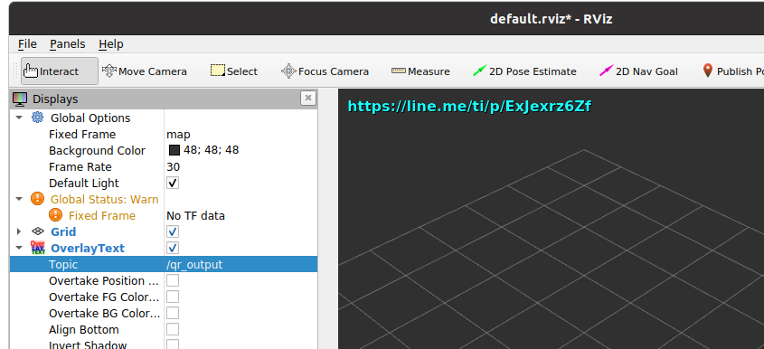

# rtr_qr_reader
Decode QR-code from image topic and show as OverlayText in rviz

## requirements
~~~bash
sudo apt install zbar-tools
pip3 install pyzbar
pip3 install opencv-python
sudo apt install ros-noetic-cv-bridge
sudo apt install ros-noetic-jsk-rviz-plugins
# opencv
~~~
## Usage
~~~bash
rosrun rtr_qr_reader rtr_qr_reader_node.py _/qr_reader/topic_name:="/usb_cam/image_raw"
~~~
