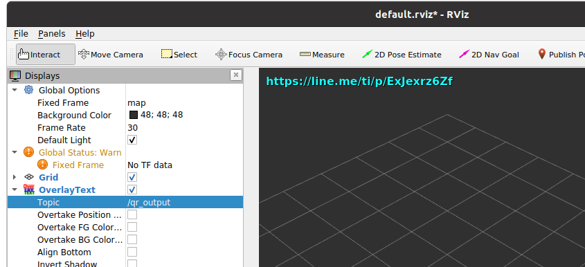

# rtr_qr_reader
Decode QR-code from image topic and show as OverlayText in rviz

## requirements
~~~bash
sudo apt install zbar-tools
pip3 install pyzbar
pip3 install opencv-python
sudo apt install ros-foxy-cv-bridge
sudo apt install ros-foxy-jsk-rviz-plugins
# opencv
~~~
## 使い方
### rtr_qr_reader_node
非推奨
### multi_qr_reader.py
複数の画像トピックからQRコードを読み取り、OverlayTextと画像に表示する．
※同時に複数の画像トピックでQRコードが発見された場合，表示が不安定になるので注意

参考launchファイル
~~~python
import launch
from launch_ros.actions import Node

def generate_launch_description():
    return launch.LaunchDescription([
        Node(
            package='rtr_qr_reader',
            executable='multi_qr_reader',
            name='multi_qr_reader',
            output='screen',
            parameters=[{'topics': '/RTRQuadcopter/Camera2/image_raw,/RTRQuadcopter/Camera3/image_raw'}]
        )
    ])
~~~
